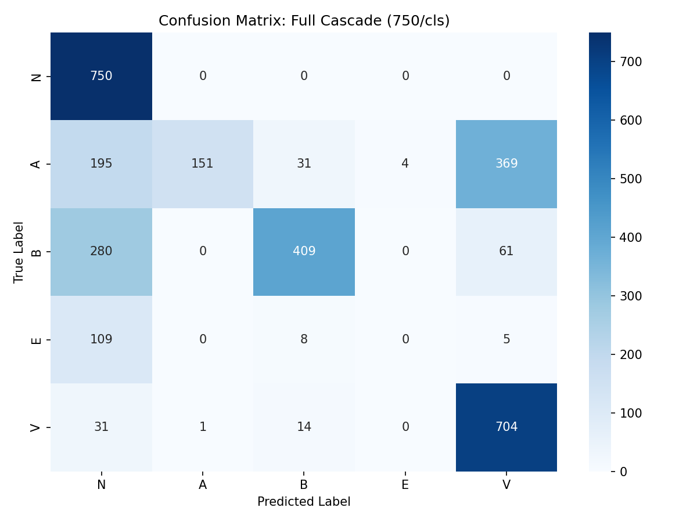

# Полный отчет об оценке каскадного классификатора

## 1. Сравнение базовой TCN и полного каскада (Таблицы 9 и 10)

### Базовая TCN (только морфология)

```
              precision    recall  f1-score   support

           N       0.30      1.00      0.47       750
           A       0.99      0.20      0.33       750
           B       0.87      0.59      0.70       750
           E       0.00      0.00      0.00       122
           V       0.00      0.00      0.00       750

    accuracy                           0.43      3122
   macro avg       0.43      0.36      0.30      3122
weighted avg       0.52      0.43      0.36      3122

```

### Полный каскад (морфология + ритм + эвристики)

```
              precision    recall  f1-score   support

           N       0.55      1.00      0.71       750
           A       0.99      0.20      0.33       750
           B       0.89      0.55      0.67       750
           E       0.00      0.00      0.00       122
           V       0.62      0.94      0.75       750

    accuracy                           0.65      3122
   macro avg       0.61      0.54      0.49      3122
weighted avg       0.73      0.65      0.59      3122

```

### Матрица ошибок полного каскада (Рисунок 20)



## 2. Оценка обнаружения R-on-T на MIT-BIH (Таблица 11)

*Записи с меткой 'r' не найдены или оценка пропущена.*

## 3. Статистика R-on-T и ПЖС на SDDB (Таблица 11)

- Всего найдено ПЖС (V+подтипы): 3409
- Всего найдено R-on-T (r): 1
- Процент R-on-T от найденных ПЖС: 0.03%

